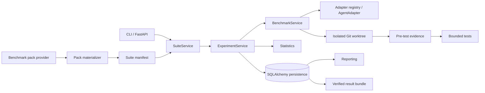

# Architecture

The authoritative detailed design is maintained in [ARCHITECTURE.md](../../ARCHITECTURE.md).

At a high level:

The principal rule is dependency direction: transports compose services; services own workflow semantics; adapters and providers enter through explicit contracts; reporting and statistics do not execute benchmarks.
